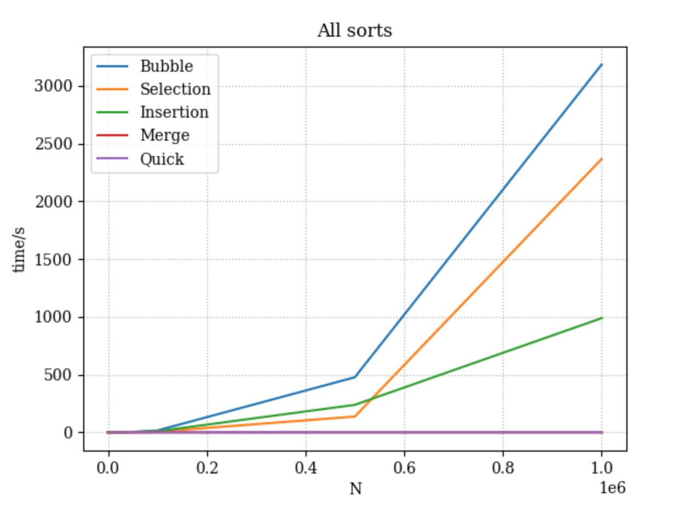
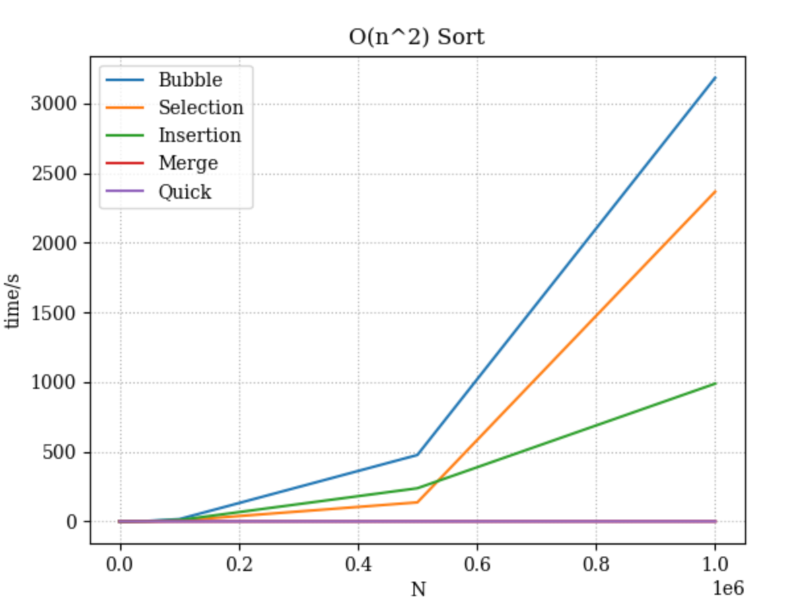
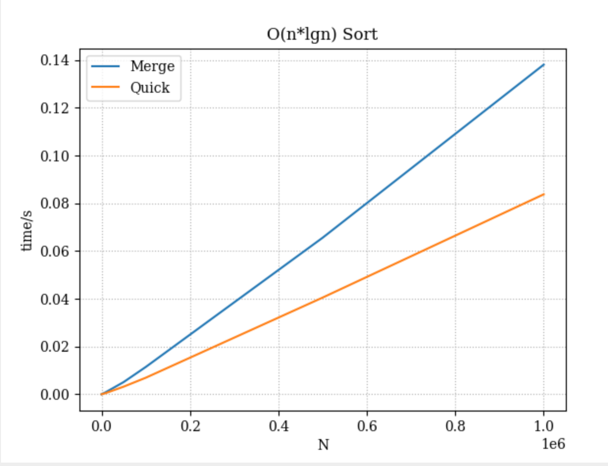

# Sort Analysis Data

## Results Table

Make sure to go out to at least 100,000 (more are welcome), and you have 10 different values (more welcome). You are welcome to go farther, but given 100,000 can take about 20 seconds using a selection sort on a fast desktop computer, and 200,000 took 77 seconds, you start having to wait much longer the more 0s you add. However, to build a clearer line, you will want more data points, and you will find merge and quick are able to handle higher numbers easier (but at a cost you will explore below).

You are free to write a script to run the program and build your table (then copy that table built into the markdown). If you do that, please include the script into the repo. Note: merge and quick sorts are going to be explored in the team activity for Module 06. You can start on it now, but welcome to wait.

### Script

```c
int main(){
    test_all(10);
    test_all(100);
    test_all(500);
    test_all(1000);
    test_all(5000);
    test_all(10000);
    test_all(50000);
    test_all(100000);
    test_all(500000);
    test_all(1000000);
    return 0;
}
```

### Table [^note]

| N       |   Bubble    |  Selection  | Insertion  |  Merge   |  Quick   |
| :------ | :---------: | :---------: | :--------: | :------: | :------: |
| 10      |  0.000001   |  0.000001   |  0.000001  | 0.000002 | 0.000001 |
| 100     |  0.000042   |  0.000022   |  0.000032  | 0.000015 | 0.000006 |
| 500     |  0.000952   |  0.000429   |  0.000759  | 0.000088 | 0.000039 |
| 1000    |  0.003817   |  0.001517   |  0.002634  | 0.000183 | 0.000078 |
| 5000    |  0.046197   |  0.016088   |  0.024175  | 0.000438 | 0.000262 |
| 10000   |  0.131384   |  0.050278   |  0.088567  | 0.000925 | 0.000533 |
| 50000   |  3.558670   |  1.263694   |  2.247974  | 0.005124 | 0.003199 |
| 100000  |  15.930903  |  5.323295   |  9.285128  | 0.011443 | 0.006936 |
| 500000  | 476.557632  | 136.495465  | 237.957338 | 0.065602 | 0.040522 |
| 1000000 | 3184.407866 | 2366.747349 | 988.658495 | 0.138128 | 0.083789 |

## BigO Analysis / Questions

### 1. Build a line chart

Build a line chart using your favorite program. Your X axis will be N increasing, and your Y access will be the numbers for each type of sort. This will create something similar to the graph in the instructions, though it won't be as smooth. Due to speed differences, you may need to break up the $O(\log n)$ and $O(n^2)$ into different charts.

Include the image in your markdown. As a reminder, you save the image in your repo, and use [image markdown].




### 2. Analysis

Looking at the graph and the table, what can you say about the various sorts? Which are the fastest? Which are the slowest? Which are the most consistent? Which are the least consistent? Use this space to reflect in your own words your observations.

> Quick is the fastest. Bubble sort is the slowest.

### 3. Big O

Build another table that presents the best, worst, and average case for Bubble, Selection, Insertion, Merge, and Quick. You are free to use resources for this, but please reference them if you do.

| Algorithm          | Best Case  | Average Case | Worst Case |
| ------------------ | ---------- | ------------ | ---------- |
| **Bubble Sort**    | O(n)       | O(n²)        | O(n²)      |
| **Selection Sort** | O(n²)      | O(n²)        | O(n²)      |
| **Insertion Sort** | O(n)       | O(n²)        | O(n²)      |
| **Merge Sort**     | O(n log n) | O(n log n)   | O(n log n) |
| **Quick Sort**     | O(n log n) | O(n log n)   | O(n²)[1]   |

#### 3.2 Worst Case

Provide example of arrays that generate _worst_ case for Bubble, Selection, Insertion, Merge Sorts

> - Bubble sort: [10, 9, 8, 7, 6, 5, 4, 3, 2, 1] (reversed order array)
> - Selection sort: Any array.
> - Insertion sort: [10, 9, 8, 7, 6, 5, 4, 3, 2, 1] (reversed order array)
> - Merge sort: Any array.

#### 3.3 Best Case

Provide example of arrays that generate _best_ case for Bubble, Selection, Insertion, Merge Sorts

> - Bubble sort: [1, 2, 3, 4, 5, 6, 7, 8, 9, 10] (already sorted array)
>
> - Selection sort: [1, 2, 3, 4, 5, 6, 7, 8, 9, 10] (already sorted array)
>
> - Insertion sort: [1, 2, 3, 4, 5, 6, 7, 8, 9, 10] (already sorted array)
> - Merge sort: Any array.

#### 3.4 Memory Considerations

Order the various sorts based on which take up the most memory when sorting to the least memory. You may have to research this, and include the mathematical notation.

> 1. Merge sort : `O(n)`
> 2. Bubble sort/ Selection sort/ Insertion sort: `O(1)`[2]

### 4. Growth of Functions

Give the following values, place them correctly into _six_ categories. Use the bullets, and feel free to cut and paste the full LatexMath we used to generate them.

$n^2$  
$n!$  
$n\log_2n$  
$5n^2+5n$  
$10000$  
$3n$  
$100$  
$2^n$  
$100n$  
$2^{(n-1)}$

#### Categories

- $100$, $10000$ 

- $3n$, $100n$ 
- $n\log_2n$ 
-  $n^2$, $5n^2+5n$ 
-  $2^n$, $2^{(n-1)}$ 
-  $n!$

### 5. Growth of Function Language

Pair the following terms with the correct function in the table.

- Constant, Logarithmic, Linear, Quadratic, Cubic, Exponential, Factorial

| Big $O$      | Name        |
| ------------ | ----------- |
| $O(n^3)$     | Cubic       |
| $O(1)$       | Constant    |
| $O(n)$       | Linear      |
| $O(\log_2n)$ | Logarithmic |
| $O(n^2)$     | Quadratic   |
| $O(n!)$      | Factorial   |
| $O(2^n)$     | Exponential |

### 6. Stable vs Unstable

Look up stability as it refers to sorting. In your own words, describe one sort that is stable and one sort that isn't stable

> - Stable: Bubble Sort, Insertion Sort, Merge Sort.
> - Unstable: Selection Sort.[3]

### 6.2 When stability is needed?

Explain in your own words a case in which you will want a stable algorithm over an unstable. Include an example.

> Sorting people's full name when the first name is already sorted[3].:
>
> - Before:
>   - *Alice*,*B*
>   - *Carol*,*A*
>   - *Dave*,*A*
>   - *Eric*,*B*
>   - *Ken*,*A*
>
> - After stable sort:
>   - *Carol*,*A*
>   - *Dave*,*A*
>   - *Ken*,*A*
>   - *Alice*,*B*
>   - *Eric*,*B*

### 7. Gold Thief

You are planning a heist to steal a rare coin that weighs 1.0001 ounces. The problem is that the rare coin was mixed with a bunch of counter fit coins. You know the counter fit coins only weight 1.0000 ounce each. There are in total 250 coins. You have a simple balance scale where the coins can be weighed against each other. Hint: don't think about all the coins at once, but how you can break it up into even(ish) piles.

#### 7.1 Algorithm

Describe an algorithm that will help you find the coin. We encourage you to use pseudo-code, but not required.

#### 7.2 Time Complexity

What is the average time complexity of your algorithm?

## Technical Interview Practice Questions

For both these questions, are you are free to use what you did as the last section on the team activities/answered as a group, or you can use a different question.

1. Select one technical interview question (this module or previous) from the [technical interview list](https://github.com/CS5008-khoury/Resources/blob/main/TechInterviewQuestions.md) below and answer it in a few sentences. You can use any resource you like to answer the question.

2. Select one coding question (this module or previous) from the [coding practice repository](https://github.com/CS5008-khoury/Resources/blob/main/LeetCodePractice.md) and include a c file with that code with your submission. Make sure to add comments on what you learned, and if you compared your solution with others.

## Deeper Thinking

Sorting algorithms are still being studied today. They often include a statistical analysis of data before sorting. This next question will require some research, as it isn't included in class content. When you call `sort()` or `sorted()` in Python 3.6+, what sort is it using?

#### Visualize

Find a graphic / visualization (can be a youtube video) that demonstrates the sort in action.

#### Big O

Give the worst and best case time-complexity, and examples that would generate them.

<hr>

## References

Add your references here. A good reference includes an inline citation, such as [1] , and then down in your references section, you include the full details of the reference. Use [ACM Reference format].

1. Parekh, D. (2025) *Sorting algorithms: Slowest to fastest*, *Built In*. Available at: https://builtin.com/machine-learning/fastest-sorting-algorithm (Accessed: 02 October 2025). 
2. GeeksforGeeks, G. (2025) *Time complexities of all sorting algorithms*, *GeeksforGeeks*. Available at: https://www.geeksforgeeks.org/dsa/time-complexities-of-all-sorting-algorithms/ (Accessed: 02 October 2025). 
3. GeeksforGeeks, G. (2025a) *Stable and unstable sorting algorithms*, *GeeksforGeeks*. Available at: https://www.geeksforgeeks.org/dsa/stable-and-unstable-sorting-algorithms/ (Accessed: 02 October 2025). 

## Footnotes:

[^note]:
    You will want at least 10 different N values, probably more to see the curve for Merge and Quick. If bubble, selection, and insertion start to take more than a minute, you can say $> 60s$ or - . For example
    | N | Bubble | Selection | Insertion | Merge | Quick |
    | :-- | :--: | :--: | :--: | :--: | :--: |
    | 10,000|0.197758|0.070548|0.000070|0.000513|0.000230|
    |100,000|-|-|-|0.131061|0.018602|

<!-- links moved to bottom for easier reading in plain text (btw, this a comment that doesn't show in the webpage generated-->

[image markdown]: https://docs.github.com/en/get-started/writing-on-github/getting-started-with-writing-and-formatting-on-github/basic-writing-and-formatting-syntax#images
[ACM Reference Format]: https://www.acm.org/publications/authors/reference-formatting
[IEEE]: https://www.ieee.org/content/dam/ieee-org/ieee/web/org/conferences/style_references_manual.pdf
